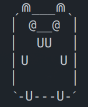

# Lib Go Say
### Cowsay reimplementation in Go lib !

[](https://opensource.org/licenses/MIT)
[](https://goreportcard.com/report/git.iglou.eu/Production/libgosay)
[](https://shields.io/)

One day, i noticed that there no lib to easy use CowSay with Go. So i made it :D

## Gopher Say with libgosay


## How to using it

First, you need to instance a var with a `Pimp` struct   
From this one you can call `Default()` for populate it, or make it manually   
When your configuration are done, you can use `Say()` to build a string formated like Cowsay   
After this exemple, you can see the cool features   

**Simple exemple**
```
package main

inport (
    "fmt"
    "git.iglou.eu/Production/libgosay"
)

func main() {
    // Instance a gosay Pimp struc
    gosay := libgosay.Pimp
    // Load default configuration
    gosay.Default()
    // Catch say result
    say, err := gosay.Say("Heya, it's me Imoen")
    if err != nil {
        // do some thing ...
    }

    fmt.Println(say)
}
```

## Cool Features

Some features are the same of `Cowsay`, but with little more.

- Max Rune by line
- Show body only without any bubble
- Can pimp your `Bubble`
- Can pimp `Tail` `Eye` `Tongue`
- Load custom ASCII Body (with `Pimp.Body = body string`)

Ex:
```
Pimp.Eye = "O"
Pimp.Tongue = "VV"
Pimp.Tail = "o"
```

Give us:
```
 _____________________ 
< Heya, it's me Imoen >
 --------------------- 
    o   ˏ⋒___⋒ˎ
     o  ▏ O__O ▕
        ▏  VV  ▕
        ▏U    U▕
        ▏      ▕
        ˋ-U---U-ˊ
```

## Pimp your bubble

**By default**, the traditionnal 'say' bubble are used
```
 ________
< A word >
 --------

 _____________________
/ Multiple line       \
| message exemple     |
\ for my BFF Imoen... /
 ---------------------
```

**But** you can using some other presconfigured Bubble   
- Think()
- Whisper()
- Narrative()

like this:
```
gosay := libgosay.Pimp
gosay.Bubble.Whisper()
```

**And**, you can also setting it manually   

`OneLine` config is used instead of `FirstLine`, `Lines` and  `LastLine`   
Only if the string you want to say, is not bigger then one line.

- Each config line use 3 Rune
- First rune are for the Left side
- Second rune is repeated X.time (string len)
- Third rune are for the Right side

```
gosay := libgosay.Pimp

// Eatch 
gosay.Bubble.Before = [3]rune{'', '', ''}
gosay.Bubble.OneLine = [3]rune{'', '', ''}
gosay.Bubble.FirstLine = [3]rune{'', '', ''}
gosay.Bubble.Lines = [3]rune{'', '', ''}
gosay.Bubble.LastLine = [3]rune{'', '', ''}
gosay.Bubble.After = [3]rune{'', '', ''}
```

## Todo

- Separate Right and Left Eye (Rune table ?)
- Tail rotation possibility (Text at right or left)

## License
|                                         |                                                                                    |
|:---------------------------------------:|------------------------------------------------------------------------------------|
|  | This project is licensed under the MIT license. The licence file is available [By clicking here](LICENSE), or in repo LICENSE file |