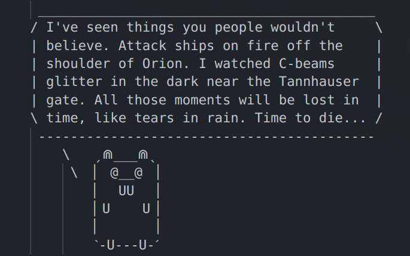

# Lib Go Say *(v1.0.1)*
### Cowsay reimplementation in Go lib !

[](https://opensource.org/licenses/MIT)
[](https://pkg.go.dev/git.iglou.eu/Production/libgosay@v1.0.1)
[](https://goreportcard.com/report/git.iglou.eu/Production/libgosay)
[](https://shields.io/)
[](https://deepsource.io/gh/IGLOU-EU/libgosay/?ref=repository-badge)

One day, i noticed that there no lib to easy use CowSay with Go. So i made it :D

## Gopher Say with libgosay


## How to using it

First, use `Create()` to instance and init a `Pimp` struct   
Now you can config you `gosay` instance like you whant   
When your configuration are done, you can use `Say()` to build a string formated like Cowsay   

**Simple exemple**
```
package main

inport (
    "fmt"

    "git.iglou.eu/Production/libgosay"
)

func main() {
    // Instance and init gosay Pimp struc
    gosay := libgosay.Create()

    // Catch say result
    say, err := gosay.Say("Heya, it's me Imoen")
    if err != nil {
        // do some thing ...
    }

    fmt.Println(say)
}
```

## Cool Features

Some features are the same of `Cowsay`, but with little more.

- Max Char by line
- Show body only without any bubble
- Can pimp your `Bubble`
- Can pimp `Tail` `Eyes` `Tongue`
- Load custom Body (with `Pimp.Body = body string`)

> **Compatible body are avaiable** *(Converted from Cowsay and Ponysay)*:    
> Official repo https://git.iglou.eu/Production/libgosay_template    
> Github repo https://github.com/IGLOU-EU/libgosay_template    

Ex:
```
gosay := libgosay.Create()

// Pimp your gosay
gosay.Eyes = "0o"
gosay.Tongue = "VV"
gosay.Tail = "o"
```

Give us:
```
 _____________________ 
< Heya, it's me Imoen >
 --------------------- 
    o   ˏ⋒___⋒ˎ
     o  ▏ 0__O ▕
        ▏  VV  ▕
        ▏U    U▕
        ▏      ▕
        ˋ-U---U-ˊ
```

## Pimp your bubble

**By default**, the traditionnal 'say' bubble are used
```
 ________
< A word >
 --------

 _____________________
/ Multiple line       \
| message exemple     |
\ for my BFF Imoen... /
 ---------------------
```

**But** you can using some other presconfigured Bubble   
- Speak()
- Think()
- ThinkUTF8()
- Whisper()
- WhisperUTF8()
- Narrative()
- BigBoxUTF8()
- AsianBoxUTF8()

like this:
```
gosay := libgosay.Create()

// Change default bubble
gosay.Bubble.Whisper()
```

**And**, you can also setting it manually   

`OneLine` config is used instead of `FirstLine`, `Lines` and  `LastLine`   
Only if the string you want to say, is not bigger then one line.

- Each config line use 3 Rune
- First rune are for the Left side
- Second rune is repeated X.time (string len)
- Third rune are for the Right side

```
gosay := libgosay.Create()

// Eatch 
gosay.Bubble.Before = [3]rune{'', '', ''}
gosay.Bubble.OneLine = [3]rune{'', '', ''}
gosay.Bubble.FirstLine = [3]rune{'', '', ''}
gosay.Bubble.Lines = [3]rune{'', '', ''}
gosay.Bubble.LastLine = [3]rune{'', '', ''}
gosay.Bubble.After = [3]rune{'', '', ''}
gosay.Bubble.Tail = ''
```

## Todo

- Open a ticket !

## License

```
 ____________________________________________________________ 
/ This project is licensed under the MIT license.            \
\ The licence file is available on repo LICENSE file         /
 ------------------------------------------------------------ 
        \   ˏ⋒___⋒ˎ
         \  ▏ @__@ ▕
            ▏  UU  ▕
            ▏U    U▕
            ▏      ▕
            ˋ-U---U-ˊ
```
